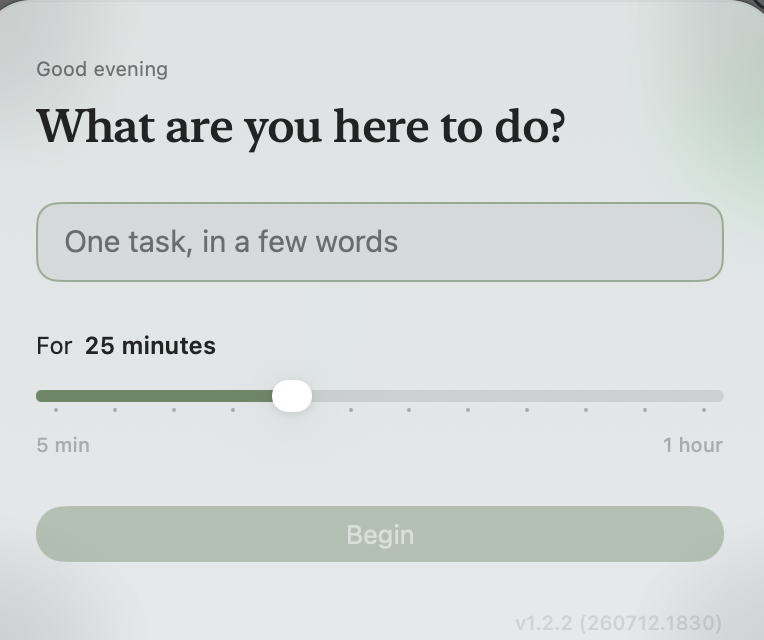

<p align="center">
  
</p>

<h1 align="center">MindfulCompute</h1>

<p align="center">
  <a href="https://github.com/FSXAC/MindfulCompute/releases/latest">
    
  </a>
</p>

A small macOS menu-bar app for intentional computer use. Before you start
working, a floating panel asks what you're here to do and for how long
(5 minutes to an hour). A Tibetan bowl marks the start; the remaining time
counts down in the menu bar. When time is up, a gong sounds and a break
panel invites you to step away — with a quote and a one-line reflection
that's saved to a journal.

## Download

Grab the latest **MindfulCompute.dmg** from the
[Releases page](https://github.com/FSXAC/MindfulCompute/releases/latest),
open it, and drag the app onto **Applications**. On first launch,
right-click the app → **Open** → **Open** (it's free / ad-hoc signed, so
macOS asks once). If it reports "damaged," run:

```sh
xattr -dr com.apple.quarantine /Applications/MindfulCompute.app
```

## Screenshots

<p align="center">
  
  <br>
  <em>The intention panel — set a task and a duration before you begin.</em>
</p>

## How it behaves

- The intention panel appears at launch and every time the Mac unlocks
  (unless a session is already running). It floats above all windows and
  can be dragged anywhere. While it waits, the rest of the screen sits
  behind a dimmer that blocks stray clicks (each one pulses the panel)
  and only lifts once a session begins; the menu bar and keyboard stay
  usable.
- Starting a session plays a Tibetan bowl and shows your intention as a
  full-screen chapter-style title card with a slow breathing guide,
  before the dimmer fades and the desktop returns. The same bowl marks
  the end of the session.
- While a session runs, everything disappears except a countdown in the
  menu bar. The countdown is anchored to wall-clock time, so locking the
  screen or sleeping doesn't pause it.
- The menu bar item offers "End session early", a "Start at login"
  toggle, and a shortcut to the journal.
- Intentions and reflections are appended to
  `~/Library/Application Support/MindfulCompute/journal.md` (readable)
  and `sessions.json` (structured, for revisiting the data later).

See [USER.md](USER.md) for user notes and a manual test checklist.

## Building

Requires Xcode (macOS 26 SDK) and [xcodegen](https://github.com/yonaskolb/XcodeGen):

```sh
./build.sh            # build only
./build.sh --install  # build, replace /Applications copy, relaunch
```

The script stamps a timestamped build number (e.g. `1.1 (260710.1645)`)
shown in the menu-bar menu and on the start panel, so a stale build is
easy to spot. The app lands in
`build/Build/Products/Release/MindfulCompute.app`; keep the installed
copy in `/Applications` so the "Start at login" toggle registers a
stable path.

## Testing the flow quickly

Launch with `MINDFUL_SECONDS=1` in the environment and the duration
slider counts seconds instead of minutes:

```sh
MINDFUL_SECONDS=1 build/Build/Products/Release/MindfulCompute.app/Contents/MacOS/MindfulCompute
```

## Notes

- If you use a menu-bar manager (Ice, Bartender, …), unhide the
  MindfulCompute item the first time — new items are often hidden by
  default.
- Sounds live in `assets/sounds` and are bundled at build time.

## Credits

- Tibetan singing bowl 1.wav by itinerantmonk108 —
  https://freesound.org/s/553049/ — License: Creative Commons 0
